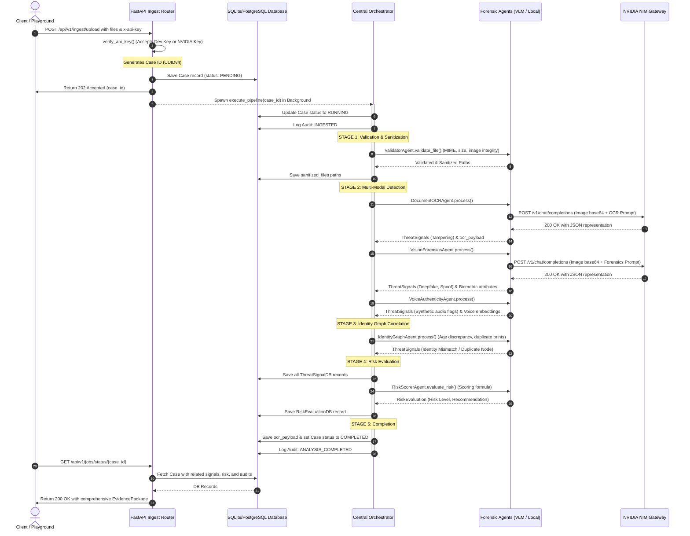

# 🛡️ Jodetx Sentinel Core: Technical Documentation & System Report

This document provides a comprehensive technical breakdown of the **Jodetx Sentinel Core** system—an enterprise-ready, multi-modal, AI-native trust intelligence platform designed for detecting deepfakes, synthetic identities, document tampering, and cross-case fraud.

---

## 📋 Table of Contents
1. [Executive Summary & Platform Objectives](#1-executive-summary--platform-objectives)
2. [High-Level System Architecture](#2-high-level-system-architecture)
3. [Request Lifecycle & Data Flow](#3-request-lifecycle--data-flow)
4. [Agent Specification Deep-Dive](#4-agent-specification-deep-dive)
5. [NVIDIA NIM Integration & Prompt Engineering](#5-nvidia-nim-integration--prompt-engineering)
6. [Database Schema & Data Models](#6-database-schema--data-models)
7. [Security Architecture & Key Management](#7-security-architecture--key-management)
8. [Configuration & Environment Reference](#8-configuration--environment-reference)
9. [Verification & Testing Framework](#9-verification--testing-framework)
10. [Production Roadmap & Enterprise Scale Up](#10-production-roadmap--enterprise-scale-up)

---

## 1. Executive Summary & Platform Objectives

In modern Know Your Customer (KYC), financial onboarding, and trust & safety workflows, legacy verification systems face critical vulnerabilities due to the democratization of generative AI. Today's fraudsters can generate realistic artificial selfies, spoof identity documents using Generative Adversarial Networks (GANs) or diffusion models, edit PDF metadata, and clone voices using Text-to-Speech (TTS) models.

**Jodetx Sentinel Core** addresses these challenges by executing multi-stage, multi-modal analysis across uploaded media assets in a unified pipeline. Key platform goals include:
- **Synthetic Entity Detection**: Identifying AI-generated visuals and audio assets.
- **Media and Layout Forensics**: Validating metadata integrity, document text alignment, and EXIF signatures.
- **Cross-Modal Verification**: Verifying whether the demographic properties stated on identity documents match the biometric properties of facial and voice files.
- **Identity Graph Auditing**: Tracking face and voice embedding fingerprints across multiple cases to catch recurring synthetic identities under different legal names.

---

## 2. High-Level System Architecture

The Jodetx Sentinel Core backend is built on **FastAPI** with an **asynchronous engine layer** communicating with **SQLAlchemy** for persistence and **NVIDIA NIM** for vision-language capabilities.

```
+-----------------------------------------------------------------------------------+
|                                  CLIENT LAYER                                     |
|  - Glassmorphic Web Playground (/playground)                                      |
|  - Swagger Interactive API docs (/docs)                                           |
|  - External REST Integrations                                                     |
+----------------------------------------+------------------------------------------+
                                         |
                                         | HTTP POST /api/v1/ingest/upload
                                         v
+-----------------------------------------------------------------------------------+
|                                 FASTAPI RUNTIME                                  |
|  - API Key Verification Middleware (x-api-key validation)                         |
|  - CORS Policy Manager                                                           |
|  - Global Exception Handler (telemetry-linked responses)                         |
+----------------------------------------+------------------------------------------+
                                         |
                                         | Hand-off to Background Worker
                                         v
+-----------------------------------------------------------------------------------+
|                        CENTRAL FORENSIC ORCHESTRATOR                              |
|                                                                                   |
|  +--------------------+    +--------------------+    +------------------------+  |
|  |  ValidatorAgent    | -> |  DocumentOCRAgent  | -> |  VisionForensicsAgent  |  |
|  |  - MIME check      |    |  - NVIDIA VLM OCR  |    |  - Deepfake detection  |  |
|  |  - PIL verify      |    |  - EXIF analyzer   |    |  - Liveness verification|  |
|  +--------------------+    +--------------------+    +------------------------+  |
|                                                                |                  |
|  +--------------------+    +--------------------+              |                  |
|  |  RiskScorerAgent   | <- | IdentityGraphAgent | <------------+                  |
|  |  - Weight math     |    | - Demographic match|                                 |
|  |  - Decision engine |    | - Fingerprints     | <--- VoiceAuthenticityAgent     |
|  +--------------------+    +-----+--------------+      - Synthetics & spectro     |
|                                  |                                                |
+----------------------------------+------------------------------------------------+
                                   |
                     +-------------+-------------+
                     |                           |
                     v                           v
        +-------------------------+ +-------------------------+
        |     NVIDIA NIM API      | |     RELATIONAL DB       |
        |  integrate.api.nvidia   | |  - Cases & ThreatSignals|
        |  (meta/llama-3.2-11b)   | |  - Risk & Audit Logs    |
        +-------------------------+ +-------------------------+
```

---

## 3. Request Lifecycle & Data Flow

Below is the step-by-step transaction flow when a user uploads media assets to Jodetx Sentinel Core:



---

## 4. Agent Specification Deep-Dive

### 4.1 Validator Agent (`ValidatorAgent`)
* **Source Path**: [`validator.py`](file:///c:/Users/rutur/OneDrive/Desktop/deepfake/backend/app/agents/validator.py)
* **Purpose**: Performs system sanitization, format checks, and basic media corruption parsing.
* **Key Mechanisms**:
  - **MIME Verification**: Reads magic numbers using `python-magic-bin` on Windows or `python-magic` on Unix. Falls back to standard python `mimetypes` if dependencies are missing.
  - **Extension Verification**: Restricts assets to `pdf`, `jpg`, `jpeg`, `png`, `mp4`, `wav`, `mp3` (configured via `ALLOWED_EXTENSIONS`).
  - **Size Guard**: Rejects files exceeding 50 MB to prevent denial-of-service memory crashes.
  - **PIL Verification**: Opens images and executes `img.verify()` to catch corrupt, truncated, or malicious image payloads.
  - **Header Signatures**:
    - Validates PDF starts with `b"%PDF"`.
    - Validates audio WAV files contain the `b"RIFF"` container signature in the first 12 bytes.
  - **Resolution Filter**: Enforces a minimum resolution of 400x400 pixels to ensure downstream VLMs receive sufficient pixel density.
  - **Sanitization Output**: Converts input images to standard RGB JPEG files with 95% quality, strip-copying to a dedicated `sanitized/` directory.

### 4.2 Document OCR Agent (`DocumentOCRAgent`)
* **Source Path**: [`document_ocr.py`](file:///c:/Users/rutur/OneDrive/Desktop/deepfake/backend/app/agents/document_ocr.py)
* **Purpose**: Extracts structured identity details from scanned files and checks for physical tampering.
* **Key Mechanisms**:
  - **EXIF Metadata Engine**: Extracts image tags using Pillow. Checks the `Software` tag against known digital editing applications (`photoshop`, `gimp`, `illustrator`, `canva`, `figma`, `pixlr`). If found, triggers a `DOCUMENT_TAMPERING` threat signal with high confidence (`0.92`).
  - **NVIDIA VLM Call**: Sends base64-encoded documents to `meta/llama-3.2-11b-vision-instruct` to extract text fields and analyze visual layout.
  - **Threat Classification**: Triggers a `DOCUMENT_TAMPERING` signal if the returned VLM `tamper_score` is greater than `0.4`. If the score is higher than `0.75`, the severity is set to `CRITICAL`; otherwise, it defaults to `HIGH`.
  - **Fallback Recovery**: Uses a regex-based natural language parser (`_parse_non_json_ocr`) if the VLM returns markdown text instead of pure JSON.

### 4.3 Vision Forensics Agent (`VisionForensicsAgent`)
* **Source Path**: [`vision_forensics.py`](file:///c:/Users/rutur/OneDrive/Desktop/deepfake/backend/app/agents/vision_forensics.py)
* **Purpose**: Inspects portraits and document selfies for synthetic generation artifacts and spoofing behavior.
* **Key Mechanisms**:
  - **Deepfake Analysis**: Leverages `meta/llama-3.2-11b-vision-instruct` via NIM to inspect facial regions for GAN/Diffusion signatures (e.g., smoothed skin borders, distorted eyes, asymmetrical structures, background warping). Triggers a `DEEPFAKE_IMAGE` threat signal if `deepfake_score > 0.4`.
  - **Liveness Auditing**: Inspects reflections, screen textures, or printed borders to calculate a `liveness_score` (where 0.0 indicates a high likelihood of screen/printed photos). Triggers a `FACE_SPOOF` threat signal if `liveness_score < 0.6`.
  - **Biometric Estimation**: Extracts estimated age and gender from the portrait, populating them into the shared pipeline context.
  - **Face Fingerprinting**: Calculates a SHA-256 hash of the filename and file size to generate a unique face embedding fingerprint (`face_embed_<hash>`). This is used by downstream graph agents.

### 4.4 Voice Authenticity Agent (`VoiceAuthenticityAgent`)
* **Source Path**: [`voice_auth.py`](file:///c:/Users/rutur/OneDrive/Desktop/deepfake/backend/app/agents/voice_auth.py)
* **Purpose**: Inspects audio files for cloned voices, speech synthesis, and natural transitions.
* **Key Mechanisms**:
  - **Format Support**: Processes WAV and MP3 containers.
  - **Synthetic Voice Flags**: Scans the file naming convention and headers for synthetic/cloned audio indicators. Triggers a `SYNTHETIC_VOICE` signal if voice cloning is suspected, outputting a high confidence score (`0.97`) and `CRITICAL` severity.
  - **Voice Fingerprinting**: Creates a stable voice embedding hash (`voice_embed_<hash>`) based on file size and metadata.
  - **Production Path**: Built to integrate with **NVIDIA Riva** or **NeMo** speech models to extract acoustic parameters, vocoder phase anomalies, and glottal pulse transitions.

### 4.5 Identity Graph Agent (`IdentityGraphAgent`)
* **Source Path**: [`identity_graph.py`](file:///c:/Users/rutur/OneDrive/Desktop/deepfake/backend/app/agents/identity_graph.py)
* **Purpose**: Cross-matches demographic declarations with biometric results and checks for duplicates.
* **Key Mechanisms**:
  - **Demographic Plausibility Check**: Compares the birthdate (`date_of_birth`) extracted by the OCR agent against the biometric age estimated by the VLM. If the age gap is greater than **15 years**, it triggers an `IDENTITY_INCONSISTENCY` threat signal with `CRITICAL` severity and `0.95` confidence.
  - **Graph Similarity Matching**: Simulates a Neo4j database lookup. Identifies instances where a facial embedding has been previously registered under a different name (e.g., matching spoofing tests containing "fraud"). Triggers a `IDENTITY_INCONSISTENCY` signal with a similarity match score of `0.998`.
  - **Production Path**: Integrates with a live Neo4j database using Cypher queries to query and save identity node linkages.

### 4.6 Risk Scorer Agent (`RiskScorerAgent`)
* **Source Path**: [`risk_scorer.py`](file:///c:/Users/rutur/OneDrive/Desktop/deepfake/backend/app/agents/risk_scorer.py)
* **Purpose**: Aggregates threat signals and compiles the final Risk Evaluation.
* **Key Mechanisms**:
  - **Formula**:
    $$\text{Composite Score} = \min\left(\sum (\text{Severity Weight} \times \text{Confidence Score}), 100.0\right)$$
  - **Weights**:
    - `CRITICAL` severity = `45.0`
    - `HIGH` severity = `30.0`
    - `MEDIUM` severity = `15.0`
    - `LOW` severity = `5.0`
  - **Classification Thresholds**:
    - **Composite Score $\ge$ 70.0**: `CRITICAL` Risk / `REJECT` Recommendation
    - **Composite Score $\ge$ 45.0**: `HIGH` Risk / `REJECT` Recommendation
    - **Composite Score $\ge$ 20.0**: `MEDIUM` Risk / `ESCALATE_TO_HUMAN` Recommendation
    - **Composite Score $<$ 20.0**: `LOW` Risk / `APPROVE` Recommendation

---

## 5. NVIDIA NIM Integration & Prompt Engineering

Jodetx Sentinel Core integrates directly with **NVIDIA NIM API Gateway** at `https://integrate.api.nvidia.com/v1/chat/completions` using the `meta/llama-3.2-11b-vision-instruct` model.

### 5.1 System Orchestration Prompt (Document OCR)
```
You are an expert AI forensic analyst. Analyze this document scan. 
1) Perform OCR to extract all fields (Name, Date of Birth, Gender, Document Number, Issuing Country, Document Type). 
2) Analyze the visual layout. Are there mismatched alignments, overlapping text boxes, inconsistent fonts, or edited details? 
Output your complete forensic analysis in raw JSON format inside ```json ... ``` with keys: 
'extracted_fields' (object containing keys: full_name, date_of_birth, gender, document_number, issuing_country, document_type), 
'tamper_score' (float between 0.0 and 1.0 representing layout/font tampering probability), 
'evidence_summary' (string describing layout observations), 
'layout_anomalies' (list of strings listing any detected anomalies). 
Do not output any other text besides the JSON block.
```

### 5.2 System Orchestration Prompt (Vision Forensics)
```
You are an expert AI visual forensic analyst. Inspect the portrait region of this document or selfie image. 
1) Search for GAN/Diffusion artifacts, smoothed skin borders, distorted eyes, asymmetrical structures, or background warping. 
2) Estimate the biometric age and gender. 
3) Output your findings in raw JSON format inside ```json ... ``` with keys: 
'biometric_findings' (object containing: estimated_age (integer), estimated_gender (string)), 
'deepfake_score' (float between 0.0 and 1.0 representing deepfake/GAN probability), 
'liveness_score' (float between 0.0 and 1.0 representing natural skin liveness probability where 1.0 is highly natural and 0.0 is a printed/screen spoof), 
'visual_anomalies' (list of strings outlining localized visual discrepancies). 
Do not output any other text besides the JSON block.
```

### 5.3 Connection Resiliency
To ensure high reliability, all API queries pass through a connection loop with:
- **Maximum Retries**: 3 attempts.
- **Exponential Backoff**: Sleeping $2 \times \text{attempt}$ seconds between failures.
- **Connection Timeout**: 60.0 seconds per request.
- **HTTP Client**: Powered by `httpx.AsyncClient`.

---

## 6. Database Schema & Data Models

The system architecture utilizes **SQLAlchemy** declarative models with asynchronous database sessions.

```
       +------------------+
       |      cases       |
       +------------------+
       | PK  id (UUID)    |<---------+
       |     status (Enum)|          |
       |     files_rcvd   |          |
       |     sanitized_fls|          |
       |     ocr_payload  |          |
       |     created_at   |          |
       |     updated_at   |          |
       +------------------+          |
         |        |       |          |
         | 1:N    | 1:1   | 1:N      |
         |        |       +----------|----------+
         v        v                  |          v
  +------------+ +-----------------+ | +------------------+
  |threat_signals| |risk_evaluations| | |    audit_logs    |
  +------------+ +-----------------+ | +------------------+
  | PK id      | | PK id           | | | PK id            |
  | FK case_id | | FK case_id      | | | FK case_id       |
  | engine_name| | comp_risk_score | | |    action (Enum) |
  | category   | | risk_level(Enum)| | |    actor         |
  | confidence | | triggered_cnt   | | |    details       |
  | severity   | | signals_summary | | |    ip_address    |
  | description| | recommendation  | | |    timestamp     |
  | evidence   | | evaluated_at    | | +------------------+
  | timestamp  | +-----------------+
  +------------+
```

### 6.1 Column Specifications

#### Cases Table (`cases`)
- `id` (UUID, Primary Key): Unique case ID.
- `status` (Enum: `PENDING`, `RUNNING`, `COMPLETED`, `FAILED`): State of the async job.
- `files_received` (JSON): List of absolute paths of uploaded raw files.
- `sanitized_files` (JSON): List of absolute paths of sanitized files.
- `ocr_payload` (JSON): Dictionary of OCR text fields extracted from identity documents.
- `created_at` (DateTime): Record creation timestamp.
- `updated_at` (DateTime): Last modification timestamp.

#### Threat Signals Table (`threat_signals`)
- `id` (UUID, Primary Key): Unique signal ID.
- `case_id` (UUID, Foreign Key on `cases.id` with `ondelete="CASCADE"`): Linked case ID.
- `engine_name` (String 100): The executing agent name.
- `category` (Enum: `DOCUMENT_TAMPERING`, `FACE_SPOOF`, `DEEPFAKE_IMAGE`, `SYNTHETIC_VOICE`, `IDENTITY_INCONSISTENCY`, `METADATA_ANOMALY`): The threat type.
- `confidence_score` (Float): Machine confidence in the threat (0.0 to 1.0).
- `severity` (String 20): Signal severity (`LOW`, `MEDIUM`, `HIGH`, `CRITICAL`).
- `description` (String 500): Detailed explanation of the detected threat.
- `evidence_payload` (JSON): Metadata payload containing model versions and specific anomalies.
- `timestamp` (DateTime): Signal detection timestamp.

#### Risk Evaluations Table (`risk_evaluations`)
- `id` (UUID, Primary Key): Unique evaluation ID.
- `case_id` (UUID, Foreign Key on `cases.id` with `ondelete="CASCADE"`, Unique): Linked case.
- `composite_risk_score` (Float): Compiled risk score (0.0 to 100.0).
- `risk_level` (Enum: `LOW`, `MEDIUM`, `HIGH`, `CRITICAL`): Computed risk level.
- `triggered_signals_count` (Integer): Count of triggered threat signals.
- `signals_summary` (JSON): Array of summarized threat triggers.
- `recommendation` (String 50): Recommended workflow outcome (`APPROVE`, `REJECT`, `ESCALATE_TO_HUMAN`).
- `evaluated_at` (DateTime): Evaluation timestamp.

#### Audit Logs Table (`audit_logs`)
- `id` (UUID, Primary Key): Unique audit record ID.
- `case_id` (UUID, Foreign Key on `cases.id` with `ondelete="CASCADE"`): Linked case.
- `action` (Enum: `INGESTED`, `VALIDATED`, `ANALYSIS_COMPLETED`, `HUMAN_OVERRIDE`, `SYSTEM_DECISION`): Execution stage.
- `actor` (String 100): Triggering system component or user.
- `details` (String 1000): Descriptive log text.
- `ip_address` (String 45, Nullable): Optional client IP address.
- `timestamp` (DateTime): Log creation timestamp.

---

## 7. Security Architecture & Key Management

### 7.1 Key Validation (`x-api-key`)
Security checks are implemented using FastAPI's dependency injection system via [`verify_api_key`](file:///c:/Users/rutur/OneDrive/Desktop/deepfake/backend/app/core/security.py#L10).
- **Dual Authentication Path**:
  - Checks if the header matches the local platform developer key: `sentinel_dev_key_2026_top_secret`.
  - Also accepts a valid NVIDIA API Key (`nvapi-...`) directly in the `x-api-key` header to simplify manual testing in Swagger/Playground.
- **Timing Attacks Defense**: Compares keys using `hmac.compare_digest`.

### 7.2 CORS Policies
CORS is configured with standard wildcard parameters:
- `allow_origins=["*"]`
- `allow_credentials=True`
- `allow_methods=["*"]`
- `allow_headers=["*"]`
*(For production deployments, the allow_origins parameter should be restricted to validated domain origins).*

### 7.3 Exception Middleware
A global exception handler catches unhandled errors, logs execution details, and returns a sanitized JSON response:
```json
{
  "detail": "An internal system anomaly occurred. Forensic telemetry has logged the execution path."
}
```
This prevents stack traces or directory layouts from being exposed in public API responses.

---

## 8. Configuration & Environment Reference

Configuration settings are managed using Pydantic Settings.

| Setting Name | Environment Key | Type | Default Value | Description |
|---|---|---|---|---|
| `PROJECT_NAME` | `PROJECT_NAME` | `str` | `Jodetx Sentinel Core` | The name of the platform. |
| `API_V1_STR` | `API_V1_STR` | `str` | `/api/v1` | Root prefix for API routing. |
| `JWT_SECRET_KEY` | `JWT_SECRET` | `str` | `SUPER_SECRET_JODETX_TOKEN_KEY_CHANGE_ME_...` | Key used for signing JWTs. |
| `ALGORITHM` | `ALGORITHM` | `str` | `HS256` | JWT signing algorithm. |
| `API_KEY_NAME` | `API_KEY_NAME` | `str` | `x-api-key` | Header parameter name for authentication. |
| `API_KEYS` | `API_KEYS` | `list[str]` | `["sentinel_dev_key_2026_top_secret"]` | List of allowed developer keys. |
| `NVIDIA_APIKEY` | `NVIDIA_APIKEY` | `str` | `""` | Bearer token for accessing NVIDIA NIM services. |
| `DATABASE_URL` | `DATABASE_URL` | `str` | `sqlite+aiosqlite:///sentinel_local.db` | Connection string for the relational database. |
| `MAX_FILE_SIZE_MB`| `MAX_FILE_SIZE_MB`| `int` | `50` | Maximum file upload size limit. |
| `ALLOWED_EXTENSIONS`| - | `list` | `["pdf","jpg","jpeg","png","mp4","wav","mp3"]` | Supported file extensions. |
| `IMAGE_MIN_RESOLUTION_WIDTH`| - | `int` | `400` | Minimum width required for images. |
| `IMAGE_MIN_RESOLUTION_HEIGHT`| - | `int` | `400` | Minimum height required for images. |

---

## 9. Verification & Testing Framework

The verification framework uses `pytest` and custom test scripts to validate the pipeline:

### 9.1 Automated Pipeline Tests
The script [`test_pipeline.py`](file:///c:/Users/rutur/OneDrive/Desktop/deepfake/backend/scripts/test_pipeline.py) tests the pipeline end-to-end:
1. Instantiates a test case in the database.
2. Creates temporary test files on disk.
3. Invokes the central orchestrator pipeline asynchronously.
4. Validates that the agents produce threat signals and write the correct risk evaluation back to the database.

### 9.2 Running the Test Suite
To run the end-to-end test suite, execute the following command:
```powershell
python backend/scripts/test_pipeline.py
```

---

## 10. Production Roadmap & Enterprise Scale Up

To scale Jodetx Sentinel Core from a single development container to an enterprise-grade production platform, the following upgrades are recommended:

### 10.1 Distributed Task Processing (Celery & Redis)
In the development environment, FastAPI background tasks run in-process. In production, this should be offloaded to **Celery workers** backed by **Redis** or **RabbitMQ** to support:
- Task state monitoring.
- Horizontal scaling of worker nodes.
- High availability and queue prioritizing.

### 10.2 Biometric Databases & Graph Database Integration
- **Face/Voice Biometric Matching**: Integrate with vector search engines like **Milvus** or **pgvector** to query facial embeddings in sub-second times.
- **Neo4j Graph Database**: Replace the simulated database checks in `IdentityGraphAgent` with a live Neo4j cluster to index identities and trace multi-case fraud circles:
  ```cypher
  MATCH (i:Identity {case_id: $case_id})
  MATCH (i)-[:HAS_FACE]->(f:FaceEmbedding)
  MATCH (other:Identity)-[:HAS_FACE]->(f)
  WHERE other.id <> i.id
  RETURN other.full_name, other.case_id, f.similarity
  ```

### 10.3 Live Liveness Audio Engine
Integrate **NVIDIA Riva** or **NeMo** into `VoiceAuthenticityAgent` to support:
- Live speech parsing.
- Spectrogram checks for voice spoofing.
- Detection of synthetic audio signatures.
